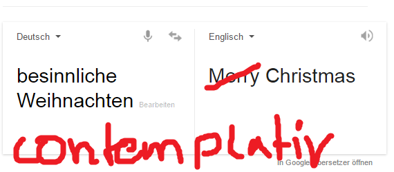

# Introducing the hellno package
Peter Meißner  
2015-12-14  

[

](https://cran.r-project.org/web/packages/hellno/index.html)


# Introduction

Base R's `stringsAsFactors` default setting is supposedly the 
  most often complained about piece of code in the whole R infrastructure. 
  A search through the source code of all CRAN packages in December 2015 ([Link](https://github.com/search?utf8=%E2%9C%93&q=user%3Acran+stringsAsFactors&type=Code))
  resulted in 3,795 mentions of `stringsAsFactors`. Most of the time these explicit 
  mentions where found within calls to `data.frame()` or `as.data.frame()` and 
  simply set the value to `FALSE`. 
  
  The hellno package provides an explicit solution to the problem without 
  changing R itself or having to mess around with options. One could use e.g.:
  `options("stringsAsFactors"=FALSE)` to re-set the global default behaviour. 
  Instead hellno tackles the problem from another direction, namely by 
  providing alternative implementations of `data.frame()` and `as.data.frame()`. 
  Those re-implementations are in fact simple wrappers around base R's very own 
  `data.frame()` and `as.data.frame()` with `stringAsFactors` option set to 
  `HELLNO` -- which in turn equals to `FALSE` and gives the package it's name.
  
  See how the buzzword flies around in the net: 
  
  - [twitter-search](https://twitter.com/search?q=stringsAsFactors%3DHELLNO&src=typd) 
  - [tweet1](https://twitter.com/quominus/status/661511485483450368) Quominus, father of `stringsAsFactors=HELLNO`
  - [tweet2](https://twitter.com/xieyihui/status/655063106024964096) the next micropackage?
  - [sillylogic](https://github.com/nutterb/sillylogic/blob/master/README.md) (The one and only package with hand-crafted logical constants)

# Using hellno interactively

Using the package is simple - load it, note the message indicating the masking ...

```r
library(hellno)
```

```
## 
## Attaching package: 'hellno'
## 
## The following objects are masked from 'package:base':
## 
##     as.data.frame, data.frame
```

... and here we go:

```r
df2 <- data.frame(a=letters[1:3])
class(df2$a)
```

```
## [1] "character"
```

# Using hellno for package development

While using the hellno package in interactive R mode is nice, in fact it could 
have been achieved simply by doing something like this: `options("stringsAsFactors"=FALSE)`. 
The strength of hellno is that it can be imported when writing packages and therefore 
providing `as.data.frame()` and `data.frame()` with `stringsAsFactors` option 
consistently set to `FALSE` throughout the whole package. 
Once imported `stringsAsFactors=FALSE` will be the default for all uses of `data.frame()` and `as.data.frame()` within all package functions BUT NOT OUTSIDE OF IT. 
Thus it provides a way to ease programming while also ensuring that package users can
still choose which flavor of `stringsAsFactors` they like best. 


Let us see how this works following a little example. Again, let us start with loading hellno package:


```r
library(hellno)
data.frame(a=letters[1:2])$a 
```

```
## [1] "a" "b"
```

As shown before, character vector are not transformed to factor.

We unload hellno again to start clean. 


```r
unloadNamespace("hellno")
```

Now we install the hellnotest package from Github and load it. The package uses hellno internally in two functions. While internal uses of `data.frame()` and `as.data.frame()` will work with `stringsAsFactors=FALSE` as default this does not change how things work everywhere else. 


```r
if( !("hellnotests" %in% installed.packages()) ){
  devtools::install_github("petermeissner/hellnotests")
}

library(hellnotests)
data.frame(a=letters[1:2])$a 
```

```
## [1] a b
## Levels: a b
```

While all functions within the package use hellno's alternative implementations:


```r
hellno_df
```

```
## function () 
## {
##     data.frame(a = letters[1:3])$a
## }
## <environment: namespace:hellnotests>
```

... and hence for them string conversion is no matter anymore:


```r
hellno_df()
```

```
## [1] "a" "b" "c"
```


... and once again to bring the point home: 


```r
data.frame(a=letters[1:2])$a 
```

```
## [1] a b
## Levels: a b
```


# Summing it up

- Writing packages with hellno does not change outside behaviour. 
- Using hellno interactively makes the change of default setting very explicit. 

Have fun and ...


